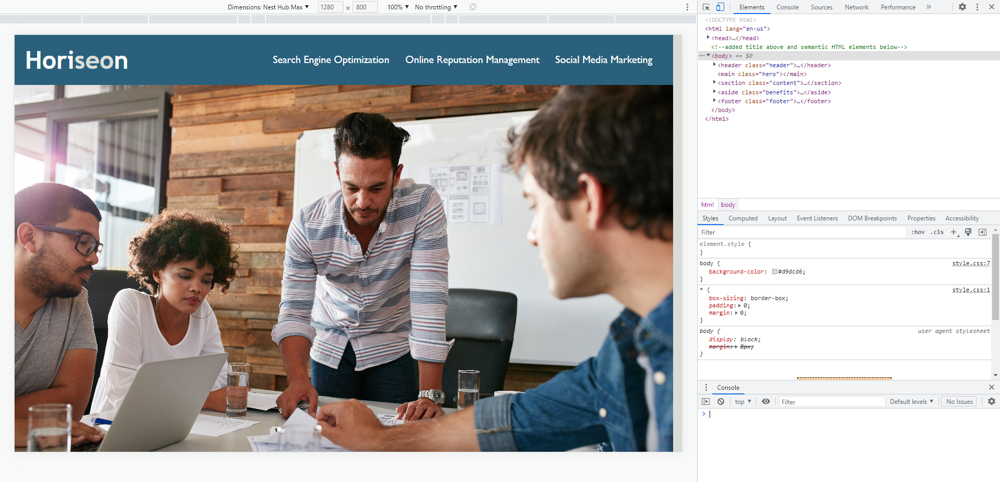

# <Horiseon Optimization Challenge>

## Description

This website was created with accessibility in mind. The website was already made but needed some refactoring to make it more accessible and improvements to the codebase for long-term sustainability including search engine optimization.

## Usage
You can view the source code and you wil find find semantic HTML elements similar to this screenshot:

